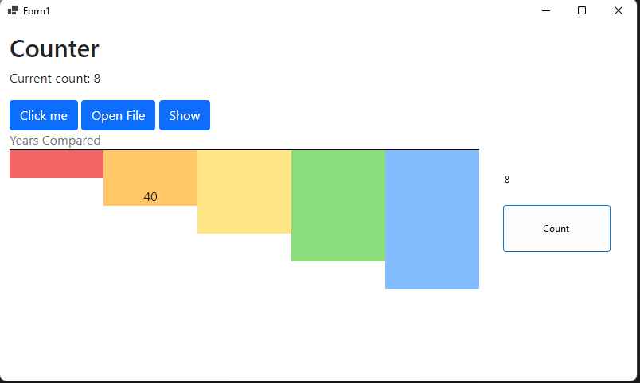

# آموزش استفاده از `Blazor` در `WindowsForm`




1 - اول یک پروژه جدید ایجاد میکنید 

2 - به قسمت `NuGet Package Manager` رفته و عبارت `Microsoft.AspNetCore.Components.WebView.WindowsForms` جستجو میکنید و نصب میکنید

3 - در قسمت `Toolbox` یک گزینه جدید اضافه میشه به اسم `BlazorWebView`  انتخاب و داخل فرم اضافه میکنید.

4 - در قسمت `Solution Explorer` میرید روی پروژه ای که ایجاد کردید دابل کلیک میکنید.

5 - در این بخش فایل رو به صورت زیر ادیت میکنید
```xml
<Project Sdk="Microsoft.NET.Sdk">
```
باید به صورت زیر تغییر بدید :

```xml
<Project Sdk="Microsoft.NET.Sdk.Razor">
```

6 - یک فایل به اسم `_Imports.razor` ایجاد میکنید و داخلش محتوای زیرو قرار میدید.

```c++
@using Microsoft.AspNetCore.Components.Forms
@using Microsoft.AspNetCore.Components.Routing
@using Microsoft.AspNetCore.Components.Web
@using Microsoft.JSInterop
```

7 - یک فولدر به اسم `wwwroot` ایجاد میکنید

8 - داخل فولدر یک فایل به اسم  `index.html` ایجاد میکنید و محتوای زیرو داخلش اضافه میکنید.

```html
<!DOCTYPE html>
<html lang="en">
<head>
    <meta charset="utf-8" />
    <meta name="viewport" content="width=device-width, initial-scale=1.0" />
    <title>titel</title>
    <base href="/" />
    <link href="css/app.css" rel="stylesheet" />
</head>

<body>

    <div id="app"></div>
    
    <div id="blazor-error-ui">
        An unhandled error has occurred.
        <a href="" class="reload">Reload</a>
        <a class="dismiss">🗙</a>
    </div>

    <script src="_framework/blazor.webview.js"></script>
</body>

</html>
```
9 - یک فولدر دیگه ایجاد میکنید `wwwroot/css`  بعد داخلش یک فایل به اسم `app.css` ایجاد میکنید محتوای زیرو داخلش اضافه میکنید.

```css
html, body {
    font-family: 'Helvetica Neue', Helvetica, Arial, sans-serif;
}
.valid.modified:not([type=checkbox]) {
    outline: 1px solid #26b050;
}
.invalid {
    outline: 1px solid red;
}
.validation-message {
    color: red;
}
#blazor-error-ui {
    background: lightyellow;
    bottom: 0;
    box-shadow: 0 -1px 2px rgba(0, 0, 0, 0.2);
    display: none;
    left: 0;
    padding: 0.6rem 1.25rem 0.7rem 1.25rem;
    position: fixed;
    width: 100%;
    z-index: 1000;
}
    #blazor-error-ui .dismiss {
        cursor: pointer;
        position: absolute;
        right: 0.75rem;
        top: 0.5rem;
    }
```

10 - برای تست هم یک فایل به اسم `counter.razor` ایجاد میکنید با محتوای به صورت زیر.

```html
<h1>Counter</h1>
<p>Current count: @currentCount</p>
<button class="btn btn-primary" @onclick="IncrementCount">Click me</button>
@code {
    private int currentCount = 0;
    private void IncrementCount()
    {
        currentCount++;
    }
}
```
11 - برای اینکه بخش `bootstrap` کار  کنهباید فایل هاشو دانلود کنید اضافه کنید که توی فیلم آموزشی قرار دادم آموزششو.

12 - حالا تو فورمی که میخواید استفاده کنید در قسمت کلستوند بعد از متد `InitializeComponent()` کد های زیرو اضافه میکنید.

```csharp
var services = new ServiceCollection();
services.AddWindowsFormsBlazorWebView();
blazorWebView1.HostPage = "wwwroot\\index.html";
blazorWebView1.Services = services.BuildServiceProvider();
blazorWebView1.RootComponents.Add<Counter>("#app");
```

13 - و پیش نیاز های زیرو ا ضافه میکنید.
```csharp
using Microsoft.AspNetCore.Components.WebView.WindowsForms;
using Microsoft.Extensions.DependencyInjection;
```

14 - داخل WPF هم همین مراحله چنتا چیزش فرق داره داخل `MainWindows.xaml` محتوای زیرو اشافه میکنید.

```html
<Window x:Class="WpfBlazor.MainWindow"
        xmlns="http://schemas.microsoft.com/winfx/2006/xaml/presentation"
        xmlns:x="http://schemas.microsoft.com/winfx/2006/xaml"
        xmlns:d="http://schemas.microsoft.com/expression/blend/2008"
        xmlns:mc="http://schemas.openxmlformats.org/markup-compatibility/2006"
        xmlns:blazor="clr-namespace:Microsoft.AspNetCore.Components.WebView.Wpf;assembly=Microsoft.AspNetCore.Components.WebView.Wpf"
        xmlns:local="clr-namespace:WpfBlazor"
        mc:Ignorable="d"
        Title="MainWindow" Height="450" Width="800">
    <Grid>
        <blazor:BlazorWebView HostPage="wwwroot\index.html" Services="{DynamicResource services}">
            <blazor:BlazorWebView.RootComponents>
                <blazor:RootComponent Selector="#app" ComponentType="{x:Type local:Counter}" />
            </blazor:BlazorWebView.RootComponents>
        </blazor:BlazorWebView>
    </Grid>
</Window>
```
15 - داخل `MainWindows.xaml.cs` محتوای زیرو اشافه میکنید.

```c#
var serviceCollection = new ServiceCollection();
serviceCollection.AddWpfBlazorWebView();
Resources.Add("services", serviceCollection.BuildServiceProvider());
```
